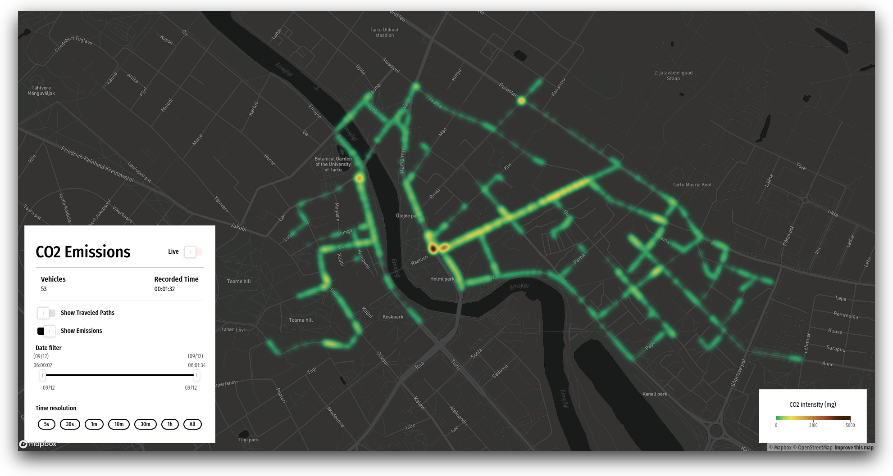

# CO2 Emission Simulator

This is the repository for the project titled "A real-time simulation based approach for quantifying CO2 emissions of urban car traffic".
It contains the report and two programs that are part of it.

The `server` folder contains the code for the backend part. It does the server gateway logic for the simulation.
To execute the program run `yarn start`

The `web-app` folder contains the code for the frontend tool. It's a visualization tool that gathers info from the server in real time.
To execute the program run `yarn start`

The `simulator` folder contains the code for the simulator. It's an automation tool that communicates with SUMO for generating vehicle traffic.
To execute the program run `python runner.py`

This is the report to the project.

### References

- https://sumo.dlr.de/docs/Simulation/Basic_Definition.html
- https://dev.to/finallynero/using-websockets-in-react-4fkp
- https://sumo.dlr.de/docs/Models/Emissions/HBEFA3-based.html
- https://sumo.dlr.de/docs/Tools/Emissions.html
- https://alloyui.com/examples/color-picker/hsv.html
- https://www.co2meter.com/blogs/news/15164297-co2-gas-concentration-defined
- https://www.lenntech.com/calculators/ppm/converter-parts-per-million.htm
- https://sumo.dlr.de/docs/Models/Emissions/HBEFA3-based.html
- https://www.influxdata.com/blog/how-to-building-flux-queries-in-chronograf/